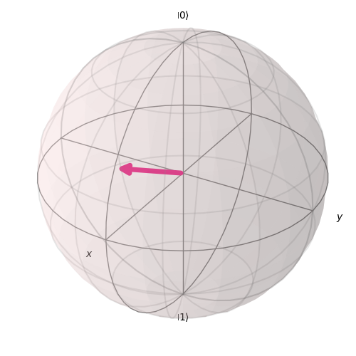
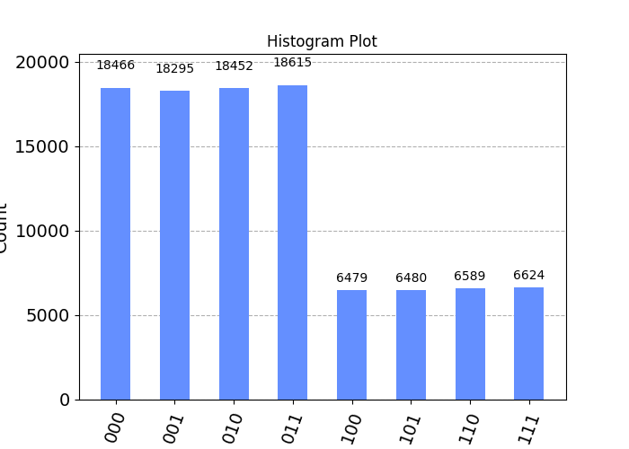

# Quantum Teleportation

This folder contains a Python script that demonstrates the concept of quantum teleportation using the `Qiskit` library, an open-source quantum computing software development framework. Quantum teleportation is a process in quantum information science where the quantum state of a particle can be transmitted from one location to another, with the help of previously shared entanglement and classical communication.

## Quantum Teleportation Process

Quantum teleportation is a fundamental concept in quantum information theory that allows the transfer of quantum information from one qubit to another, leveraging the principles of quantum entanglement and classical communication. This script showcases a simplified version of the quantum teleportation protocol using the Qiskit library. The quantum state of `qubit 0` is teleported to `qubit 2` through the entanglement of `qubit 1`.

## Code Overview

1. Library Imports:
The script begins by importing necessary libraries such as `random`, `numpy`, and components from the Qiskit library including `QuantumCircuit`, `QuantumRegister`, `ClassicalRegister`, `Aer`, `marginal_counts`, and visualization tools from `plot_histogram` and `plot_bloch_vector`.

2. Function Definitions:
    - `create_registers()` function is defined to create the required quantum and classical registers and initialize a QuantumCircuit for the teleportation process.

    - `generate_amplitudes()` function generates random values for the quantum bit (qubit) 0's alpha and beta, representing the amplitudes in the quantum state.

    - `add_gates()` function adds various quantum gates (like initialize, Hadamard, controlled-not, and measurements) to the circuit for the teleportation protocol based on the provided amplitudes.

    - `amplitude_to_bloch()` function is defined to convert the calculated amplitudes to Bloch vector coordinates.

3. Quantum Circuit Execution:
The script generates the necessary amplitudes, creates the quantum circuit, adds gates, and displays the circuit diagram.

4. Simulation and Result Analysis:
The circuit is executed on a Qiskit Aer simulator backend with a specified number of shots (100000 shots in this case). The script then retrieves the results and performs analysis to obtain the quantum state of qubit 2 after the teleportation process. The Bloch vector coordinates are also calculated and displayed.

5. Visualization and Output Saving:
The script generates visualization components including a Bloch vector plot and a histogram plot representing the measurement outcomes. These visualizations are saved as image files, along with the circuit diagram.

## Example

    Qbit 0: |ψ⟩ (0.8592, 0.5117)
    Qbit 2: |ψ⟩ (0.8592, 0.5116)
    Bloch Vector: (0.8791, 0.0000, 0.4766)

